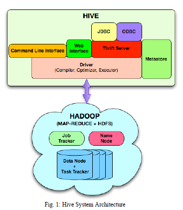

## Hive是什么？
- 建立在Hadoop之上的用于管理和查询结构化数据的系统。
  - map-reduce用于执行
  - hdfs用于存储
  - metadata存储hdfs文件元数据

## 为什么有Hive？
数据量不断增大，已有的解决方法存在以下问题：
- 可用性差
- 无法扩展
- 价格高  

所以尝试使用Hadoop：
- 优点
  - 可用性好，可扩展，易于管理
- 缺点
  - 性能不高，但可以增加硬件。
  - 很难编程：map-reduce编程模型是低层次的，需要开发者写编写难以维护和重用的自定义程序。
  - 没有schema。

所以产生了Hive。

## 如何做？
在hadoop上提供类似sql的声明式查询语言。

设计原则：
- 类SQL语言
- 可扩展
- 性能
### 数据模型
- Table
- Partitions
- Bucket
> 为什么要分区和分桶？  
> 让查询发生在小范围的数据上提高效率。

### 架构

- Metastore：存储系统数据目录和有关表，列，分区的元信息。
- Driver：管理在Hive中移动HiveSQL语句的生命周期的组件。驱动程序还维护会话句柄和所有会话统计信息。
- 查询编译器：编译HiveSQL为map/reduce任务的有向无环图。
- 执行引擎：以正确的依赖顺序执行由编译器产生的任务的组件。执行引擎与底层Hadoop实例进行交互。
- HiveServer：提供thrift接口和JDBC/ODBC服务器的组件，并提供将Hive与其他应用程序集成的方式。
- Client：包括命令行接口（CLI）,web UI，JDBC/ODBC驱动。

## 2019
- 支持事务
- 优化器
- runtime
- Federation
